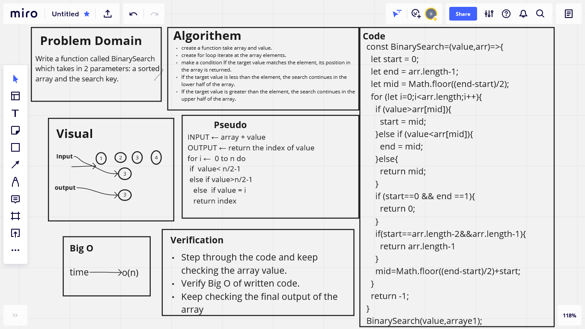

# Binary Search of Sorted Array

Write a function called BinarySearch which takes in 2 parameters: a sorted array and the search key.

## Whiteboard Process

## Approach & Efficiency

It take an hour first I wrote a discription of the code and the problem domain then start coding
