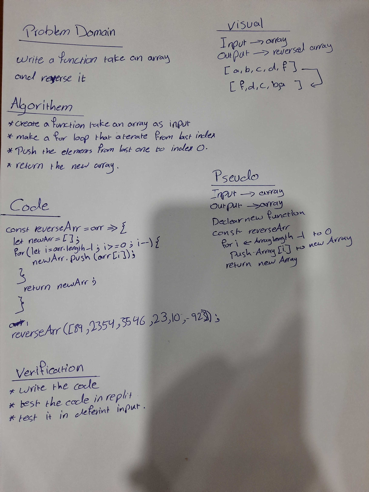

# Reverse an Array
<!-- We should write a function recive an array as input and the output the reverse of that array  -->

## Whiteboard Process

## Approach & Efficiency
<!-- First I make a function contain foor loop take an array as input and reverse it and push it in a new array -->
