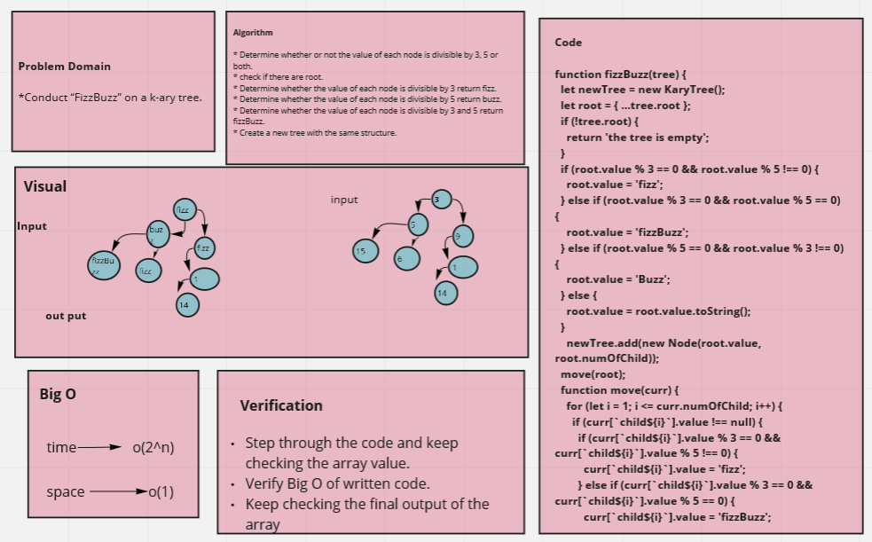

## Challenge

* Write a function called FizzBuzzTree which takes a k-ary tree as an argument.
* Determine whether or not the value of each node is divisible by 3, 5 or both.
* Create a new tree with the same structure as the original, but the values modified as follows:
  *  If the value is divisible by 3, replace the value with “Fizz”.
  *  If the value is divisible by 5, replace the value with “Buzz”.
  *  If the value is divisible by 3 and 5, replace the value with “FizzBuzz”.
  *  If the value is not divisible by 3 or 5, simply turn the number into a String.

## Approach & Efficiency
write the problem domaine and the algoritheme of the code then write the code stipe by stipe and test it.

Note : I worked as a group with my colleagues . 

## UML Diagrame

