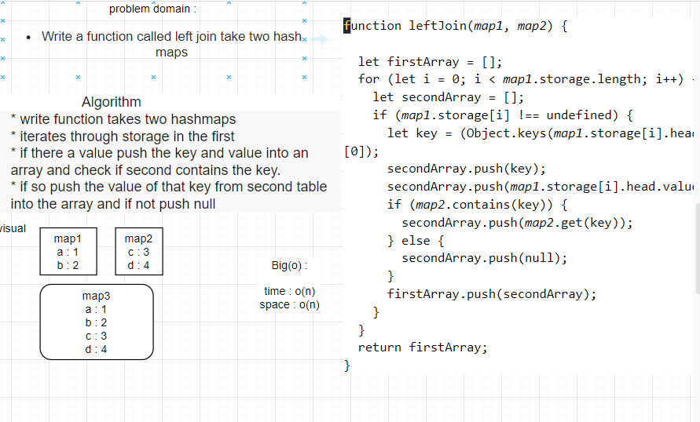

# Hashtables

* A hash table (hash map) is a data structure that implements an associative array abstract data type.
* A structure that can map keys to values.
* A hash table uses a hash function to compute an index, also called a hash code, into an array of buckets or slots, from which the desired value can be found. During lookup, the key is hashed and the resulting hash indicates where the corresponding value is stored.

## Challenge

Implement a Hashtable Class

## API

- **add :** Arguments: key, value and Returns: nothing.

> This method should hash the key, and add the key and value pair to the table, handling collisions as needed.

- **get :** Arguments: key ,Returns: Value associated with that key in the table

- **contains :** Arguments: key , Returns: Boolean then indicating if the key exists in the table already.

- **hash :** Arguments: key , Returns: Index in the collection for that key

- **repeatedWord :** Find the first repeated word in a book.
- **leftjoin :** Write a function called left join take two hash maps
## white board

