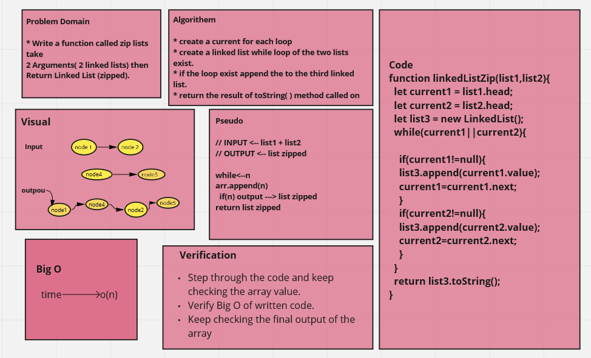

# Singly Linked List

> Linked List is a sequence of Nodes that are connected to each other.

>If we want to add a node with an O(1) efficiency, we have to replace the current Head of the linked list with the new node, without losing the reference to the next node in the list.

> Adding a node to the middle of a linked list is a bit different than adding to the beginning. This is because we are working with more nodes and must re-allocate to make room for the new node.

## Challenge

Create a Node class that has properties for the value stored in the Node, and a pointer to the next Node.

Added new functions to append a new value, append before append after

## Approach & Efficiency
write the problem domaine and the algoritheme of the code then write the code stipe by stipe and test it.

## API
**insert** : Adds a new node with that value to the head of the list with an O(1) Time performance.
**includes**: Indicates whether that value exists as a Node’s value somewhere within the list.
**to string** : Returns: a string representing all the values in the Linked List.
**append**: add new value too the end.
**append after** : add new value after specific node.
**append before** : add new value before specific node.

## Whiteboard Process

