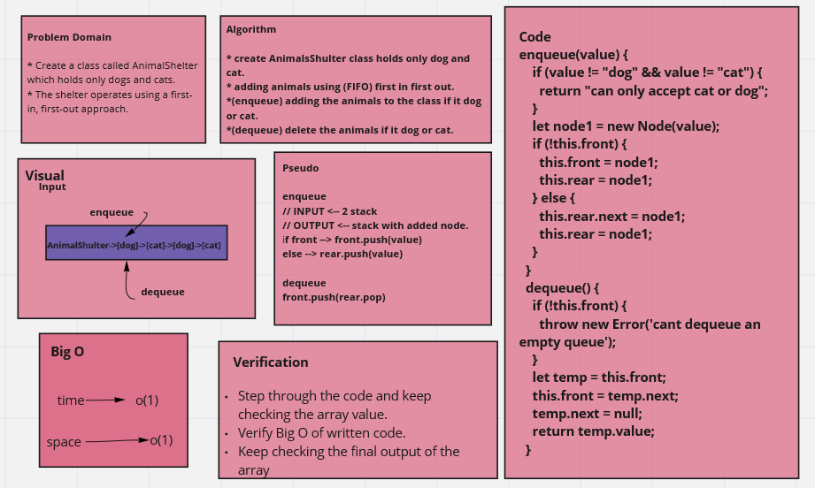

# Stacks and Queues

> Create a class called AnimalShelter which holds only dogs and cats.
> The shelter operates using a first-in, first-out approach

## Challenge

* enqueue(animal): adds animal to the shelter. animal can be either a dog or a cat object
* dequeue(pref): returns either a dog or a cat. If pref is not "dog" or "cat" then return null
 

## Approach & Efficiency
write the problem domaine and the algoritheme of the code then write the code stipe by stipe and test it.

## UML Diagram

