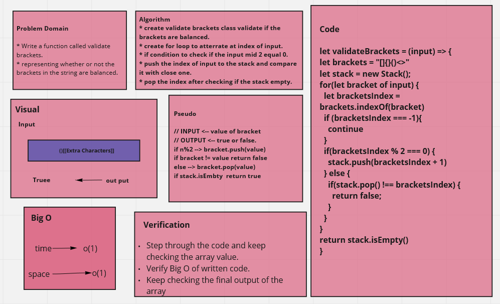

# Stacks and Queues Brackets

> Write a function called validate brackets
> Arguments: string
> Return: boolean

## Challenge

> validateBrackets representing whether or not the brackets in the string are balanced

 

## Approach & Efficiency
write the problem domaine and the algoritheme of the code then write the code stipe by stipe and test it.

## Note

**I search for recources and internet articles to solve this chalenge because it was hard**  

## UML Diagram

