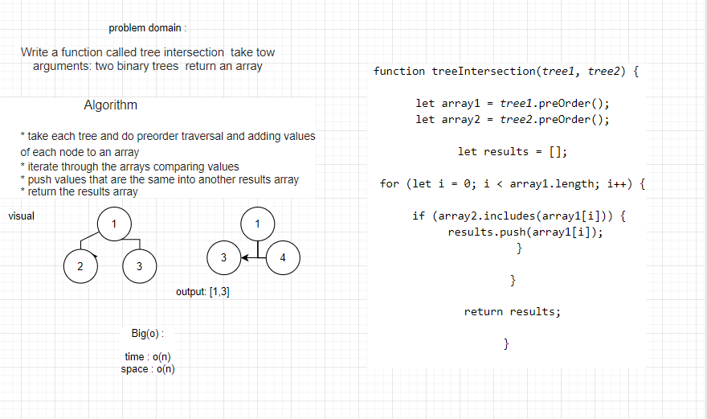

## Challenge

> Create a Node class that has properties for the value stored in the node
> Create a Binary Search Tree class 
> Adds a new node with that value in the correct location in the binary search 
> Returns: boolean indicating whether or not the value is in the tree at least 
> Traverse the input tree using a Breadth-first approach

## Approach & Efficiency
write the problem domaine and the algoritheme of the code then write the code stipe by stipe and test it.

Note : I worked as a group with my colleagues . 

## API
**add**: Adds a new node with that value in the correct location in the binary search 

**Contains**: Returns: boolean indicating whether or not the value is in the tree at least 

**getMax**: Find the maximum value stored in the tree.

**breadthFirst**: list of all values in the tree, in the order they were encountered

**treeIntersection**: take tow arguments: two binary trees  return an array.

## UML Diagrame

